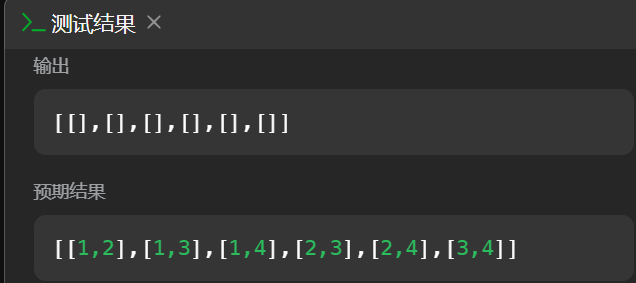

# C#对象引用

该问题是在写[LeetCode题77.组合](https://leetcode.cn/problems/combinations/description/)时发现的

本题C++代码如下：
```python
class Solution {
private:
    vector<vector<int>> ans;
    vector<int> res;
    
    void backTracking(int n,int k,int start){
        if(res.size()==k){
            ans.push_back(res);
            return;
        }
        for(int i=start;i<=n-(k-res.size())+1;i++){
            res.emplace_back(i);
            backTracking(n,k,i+1);
            res.pop_back();
        }
    }
public:
    vector<vector<int>> combine(int n, int k) {
        backTracking(n,k,1);
        return ans;
    }
};
```
我最初将其更改为C#代码后为：
```python
public class Solution {
    IList<IList<int>> ans=new List<IList<int>>();
    IList<int> res=new List<int>();
    public IList<IList<int>> Combine(int n, int k) {
        BackTracking(n,k,1);
        return ans;
    }

    private void BackTracking(int n,int k,int start){
        if(res.Count==k){
            ans.Add(res);
            return;
        }
        for(int i=start;i<=n-(k-res.Count)+1;i++){
            res.Add(i);
            BackTracking(n,k,i+1);
            res.RemoveAt(res.Count-1);
        }
    }
}
```
但是实际运行后发现`ans`中的数组全部为空：

原因在`ans.Add(res);`这句代码，这里添加的实际上是`res`的引用而非副本，所以当修改`res`时，`ans`中的所有元素都会收到影响，当递归调用结束后`res`最终会变为空，所以`ans`中的所有元素最终也会为空。

解决办法是将代码更改为`ans.Add(new List<int>(res));`,这里创建了一个`res`的副本并添加到`ans`中，之后再修改`res`时就不会对已经添加到`ans`中的元素造成影响。

最终正确的C#代码如下：
```python
public class Solution {
    IList<IList<int>> ans=new List<IList<int>>();
    IList<int> res=new List<int>();
    public IList<IList<int>> Combine(int n, int k) {
        BackTracking(n,k,1);
        return ans;
    }

    private void BackTracking(int n,int k,int start){
        if(res.Count==k){
            ans.Add(new List<int>(res));
            return;
        }
        for(int i=start;i<=n-(k-res.Count)+1;i++){
            res.Add(i);
            BackTracking(n,k,i+1);
            res.RemoveAt(res.Count-1);
        }
    }
}
```